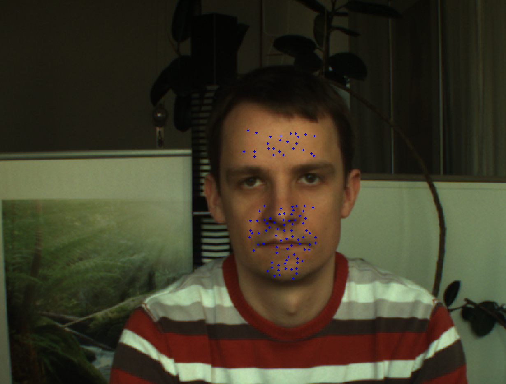

# pulse_from_head_motion
Python code for estimating pulse rate from head motions in video.
Based on the paper, "Detecting Pulse from Head Motions in Video" by Balakrishnan et al.

This code assumes the input video framerate is 30 FPS.

## How to Run
`python3 main.py <path to input video file>`

## Checkpoint 1
The face is detected with a Haar Cascade face classifier. Feature points on the upper and lower regions of the face
(excluding the eye region) are tracked frame-by-frame using Lucas-Kanade optical flow:

Only the y-coordinates of each point are considered for analysis:

The time series is interpolated to increase the sampling frequency to 250 Hz (sampling frequency
of an ECG):

## Checkpoint 2
The interpolated time series are filtered using a 5th order Butterworth filter with a pass band of
[0.8, 3] Hz:

Filtered data series with L2 norms in the top 25% are removed to reduce the effects of noise caused by
body adjustments and facial expression. Principal component analysis (PCA) is then applied to further reduce
the effects of noise caused by respiration and vestibular activity:

## Checkpoint 3
The dominant frequency of the head movement is finally extracted by finding the frequency and first harmonic
which contribute the most to the total power of the signal. The dominant frequency of the most periodic
source signal is taken as the heart rate:

Estimated BPM = 65.78

Ground truth BPM = 68.11

## Results
This pipeline was tested on 7 distinct input videos paired with ground truth BPM data produced by a 60 Hz pulse
oximeter. In general, the pulse rates measured from the videos matched very closely with the ground
truth rates, differing only by ~2-3 BPM at most.

For comparison, I tested another contactless pulse monitoring method called remote photoplethysmography (rPPG).
rPPG differs from the method proposed by Balakrishnan et al. by measuring variations in transmitted
or reflected light in the skin rather than oscillatory motions of the head. Heart rate is estimated
by analyzing subtle changes in the color of the skin. I performed my comparisons using an open source
rPPG desktop application developed by Philipp Rouast (https://github.com/prouast/heartbeat). The results
showed a few similar outcomes but poorer performance overall compared to the head motion method. The
rPPG method had most difficulty with subjects who had long hair that occluded parts of their face.
In contrast, the head motion method does not have this issue because it is based on movement.

Final results are shown below:

The are many directions for future work. I think the next logical step would be to create a real-time system that tracks pulse rate from a webcam and compare the accuracy to the one-shot method given in this code. Also, this code uses a Haar cascade face classifier which is typically used for fast face detection but is not always the most accurate. Other face detectors may be evaluated and are available in many free software libraries such as OpenCV. Finally, this paper takes a strictly signal processing approach to isolating the head movement source signal and calculating dominant frequency. It would be interesting to try a machine learning approach which uses convolutional neural networks to learn how to detect pulse from ground truths and compare its accuracy to the signal processing method. Alternatively, a hybrid approach may be to train a machine learning algorithm on the processed signals.
